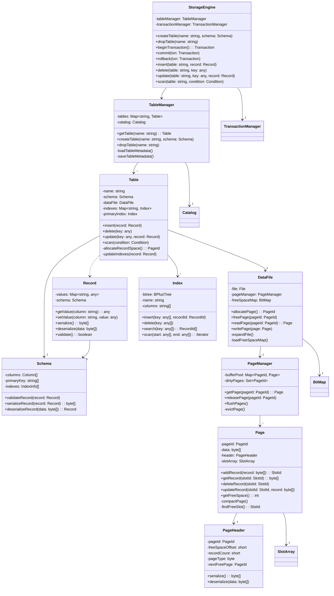

```mermaid
classDiagram
    class StorageEngine {
        -tableManager: TableManager
        -transactionManager: TransactionManager
        +createTable(name: string, schema: Schema)
        +dropTable(name: string)
        +beginTransaction(): Transaction
        +commit(txn: Transaction)
        +rollback(txn: Transaction)
        +insert(table: string, record: Record)
        +delete(table: string, key: any)
        +update(table: string, key: any, record: Record)
        +scan(table: string, condition: Condition)
    }

    class TableManager {
        -tables: Map~string, Table~
        -catalog: Catalog
        +getTable(name: string): Table
        +createTable(name: string, schema: Schema)
        +dropTable(name: string)
        -loadTableMetadata()
        -saveTableMetadata()
    }

    class Table {
        -name: string
        -schema: Schema
        -dataFile: DataFile
        -indexes: Map~string, Index~
        -primaryIndex: Index
        +insert(record: Record)
        +delete(key: any)
        +update(key: any, record: Record)
        +scan(condition: Condition)
        -allocateRecordSpace(): PageId
        -updateIndexes(record: Record)
    }

    class Schema {
        -columns: Column[]
        -primaryKey: string[]
        -indexes: IndexInfo[]
        +validateRecord(record: Record)
        +serializeRecord(record: Record): byte[]
        +deserializeRecord(data: byte[]): Record
    }

    class DataFile {
        -file: File
        -pageManager: PageManager
        -freeSpaceMap: BitMap
        +allocatePage(): PageId
        +freePage(pageId: PageId)
        +readPage(pageId: PageId): Page
        +writePage(page: Page)
        -expandFile()
        -loadFreeSpaceMap()
    }

    class PageManager {
        -bufferPool: Map~PageId, Page~
        -dirtyPages: Set~PageId~
        +getPage(pageId: PageId): Page
        +releasePage(pageId: PageId)
        +flushPages()
        -evictPage()
    }

    class Page {
        -pageId: PageId
        -data: byte[]
        -header: PageHeader
        -slotArray: SlotArray
        +addRecord(record: byte[]): SlotId
        +getRecord(slotId: SlotId): byte[]
        +deleteRecord(slotId: SlotId)
        +updateRecord(slotId: SlotId, record: byte[])
        +getFreeSpace(): int
        -compactPage()
        -findFreeSlot(): SlotId
    }

    class PageHeader {
        -pageId: PageId
        -freeSpaceOffset: short
        -recordCount: short
        -pageType: byte
        -nextFreePage: PageId
        +serialize(): byte[]
        +deserialize(data: byte[])
    }

    class Record {
        -values: Map~string, any~
        -schema: Schema
        +getValue(column: string): any
        +setValue(column: string, value: any)
        +serialize(): byte[]
        +deserialize(data: byte[])
        +validate(): boolean
    }

    class Index {
        -btree: BPlusTree
        -name: string
        -columns: string[]
        +insert(key: any[], recordId: RecordId)
        +delete(key: any[])
        +search(key: any[]): RecordId[]
        +scan(start: any[], end: any[]): Iterator
    }

    StorageEngine --> TableManager
    StorageEngine --> "1" TransactionManager
    TableManager --> "*" Table
    TableManager --> "1" Catalog
    Table --> "1" Schema
    Table --> "1" DataFile
    Table --> "*" Index
    DataFile --> "1" PageManager
    DataFile --> "1" BitMap
    PageManager --> "*" Page
    Page --> "1" PageHeader
    Page --> "1" SlotArray
    Table ..> Record
    Record --> "1" Schema
```
