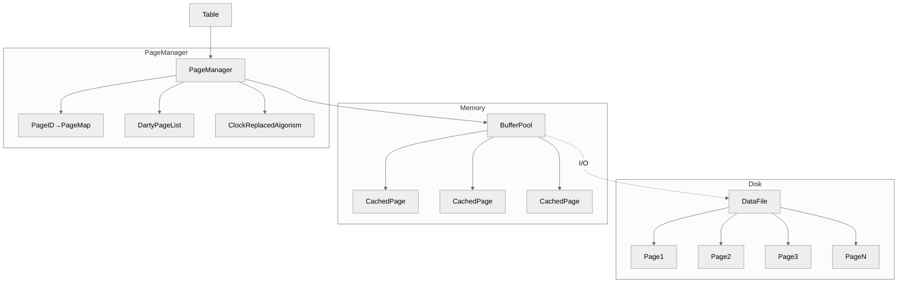

```mermaid
%%{init: {'theme': 'neutral'}}%%
graph TD
    subgraph "Disk"
        disk[DataFile] --> page1[Page1]
        disk --> page2[Page2]
        disk --> page3[Page3]
        disk --> pageN[PageN]
    end

    subgraph "Memory"
        bpool[BufferPool] --> cached1[CachedPage]
        bpool --> cached2[CachedPage]
        bpool --> cached3[CachedPage]
    end

    subgraph "PageManager"
        pm[PageManager] --> hash[PageID→PageMap]
        pm --> dirty[DartyPageList]
        pm --> clock[ClockReplacedAlgorism]
    end

    table[Table] --> pm
    pm --> bpool
    bpool -.I/O.-> disk
```
