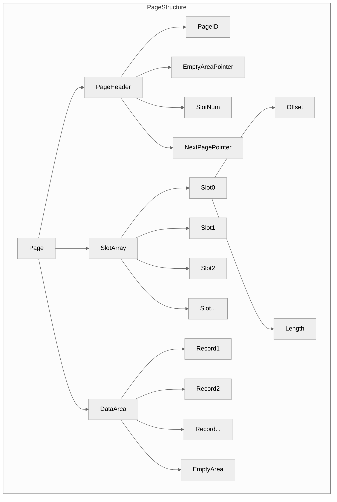

```mermaid
%%{init: {'theme': 'neutral'}}%%
graph TD
    subgraph "PageStructure"
        A[Page] --> B[PageHeader]
        A --> C[SlotArray]
        A --> D[DataArea]

        B --> B1[PageID]
        B --> B2[EmptyAreaPointer]
        B --> B3[SlotNum]
        B --> B4[NextPagePointer]

        C --> C1[Slot0]
        C --> C2[Slot1]
        C --> C3[Slot2]
        C --> C4[Slot...]

        C1 --> E1[Offset]
        C1 --> E2[Length]

        D --> F1[Record1]
        D --> F2[Record2]
        D --> F3[Record...]
        D --> F4[EmptyArea]
    end
```
