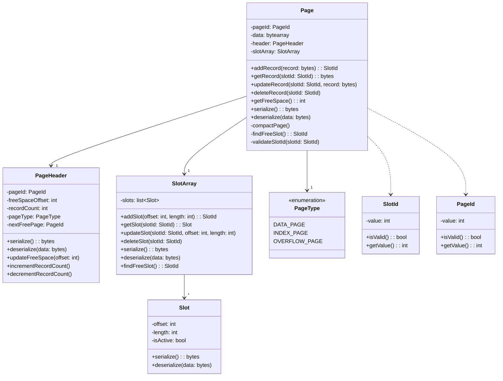

```mermaid
classDiagram
    class Page {
        -pageId: PageId
        -data: bytearray
        -header: PageHeader
        -slotArray: SlotArray
        +addRecord(record: bytes) : SlotId
        +getRecord(slotId: SlotId) : bytes
        +updateRecord(slotId: SlotId, record: bytes)
        +deleteRecord(slotId: SlotId)
        +getFreeSpace() : int
        +serialize() : bytes
        +deserialize(data: bytes)
        -compactPage()
        -findFreeSlot() : SlotId
        -validateSlotId(slotId: SlotId)
    }

    class PageHeader {
        -pageId: PageId
        -freeSpaceOffset: int
        -recordCount: int
        -pageType: PageType
        -nextFreePage: PageId
        +serialize() : bytes
        +deserialize(data: bytes)
        +updateFreeSpace(offset: int)
        +incrementRecordCount()
        +decrementRecordCount()
    }

    class SlotArray {
        -slots: list~Slot~
        +addSlot(offset: int, length: int) : SlotId
        +getSlot(slotId: SlotId) : Slot
        +updateSlot(slotId: SlotId, offset: int, length: int)
        +deleteSlot(slotId: SlotId)
        +serialize() : bytes
        +deserialize(data: bytes)
        +findFreeSlot() : SlotId
    }

    class Slot {
        -offset: int
        -length: int
        -isActive: bool
        +serialize() : bytes
        +deserialize(data: bytes)
    }

    class PageType {
        <<enumeration>>
        DATA_PAGE
        INDEX_PAGE
        OVERFLOW_PAGE
    }

    class SlotId {
        -value: int
        +isValid() : bool
        +getValue() : int
    }

    class PageId {
        -value: int
        +isValid() : bool
        +getValue() : int
    }

    Page --> "1" PageHeader
    Page --> "1" SlotArray
    Page --> "1" PageType
    SlotArray --> "*" Slot
    Page ..> SlotId
    Page ..> PageId
```
